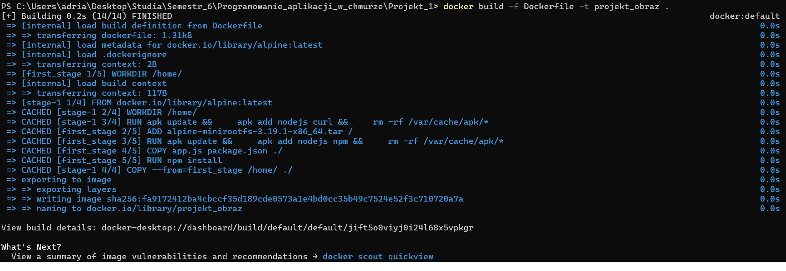
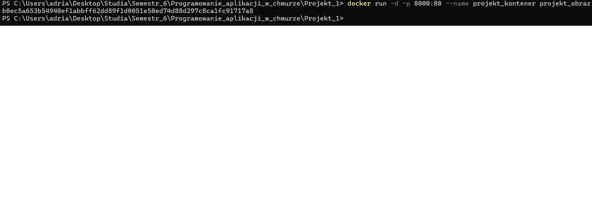
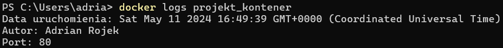
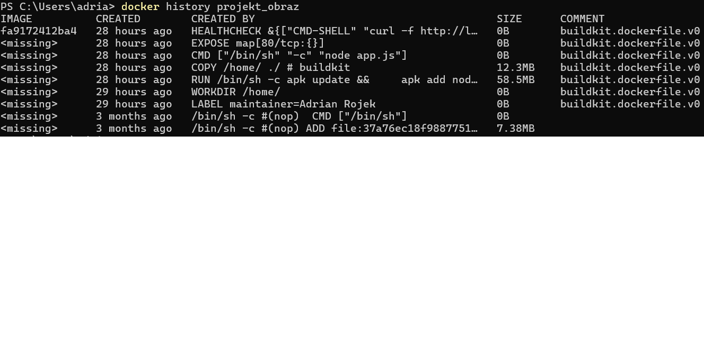

> <h1>Budowa obrazu</h1>
> <strong> docker build -f Dockerfile -t projekt_obraz . </strong>
> 

> <h1> Uruchomienie kontenera </h1>
> docker run -d -p 8000:80 --name projekt_kontener projekt_obraz
> 

> <h1> Aplikacja </h1>
> 

> <h1> Pozyskanie logów wygenerowanych podczas uruchomienia kontenera </h1>
> docker logs projekt_kontener
> 

> <h1> Sprawdzenie ilości warstw utworzonego obrazu </h1>
> docker history projekt_obraz
> 

> <h1> Analiza podatności utworzonego obrazu na zagrożenia </h1>
> docker scout quickview projekt_obraz
> 
